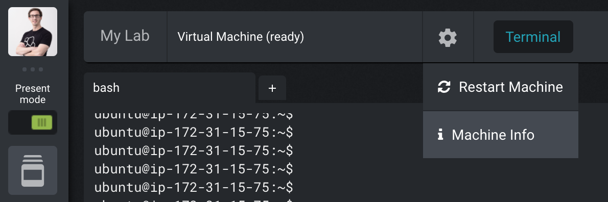
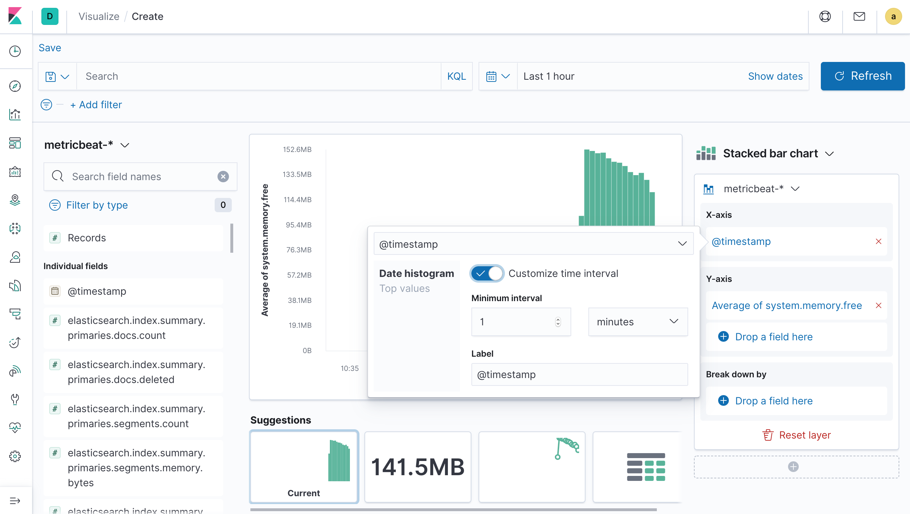

# Scale Elasticsearch Workshop

Hands-on workshop on how to scale Elasticsearch.


## Workshop

We are running through this together and dive into the relevant parts. For the lab, head to *My Lab* in Strigo:

1. Look at the configuration files in */opt/elasticsearch-{hot,warm,cold}/config/elasticsearch.yml*.
1. Start all three Elasticsearch nodes with `/opt/elasticsearch-{hot,warm,cold}/bin/elasticsearch -d`.
1. Check that the hot node has successfully started with `curl -u admin:secret http://localhost:9200/`.
1. Check the cluster state with `curl -u admin:secret localhost:9200/_cat/nodes?v`. It has to show the same three `name` attributes — otherwise please ping us for help:

    ```
    ip        heap.percent ram.percent cpu load_1m load_5m load_15m node.role master name
    127.0.0.1           41          89   6    1.45    0.97     0.64 dilmrt    -      es-hot
    127.0.0.1           67          89   6    1.45    0.97     0.64 dilmrt    *      es-warm
    127.0.0.1           33          89   6    1.45    0.97     0.64 dilmrt    -      es-cold
    ```

1. Start Kibana with `sudo service kibana start`.
1. Copy the DNS name of your node under *Machine info*.

    

1. Access Kibana on port 5601 of your DNS name. The credentials are *admin* and *secret*.
1. Run the following requests in Kibana's *Dev Tools* → *Console*:

    ```js
    PUT _cluster/settings
    {
      "persistent": {
        "indices.lifecycle.poll_interval": "5s"
      }
    }


    PUT _ilm/policy/metricbeat
    {
      "policy" : {
        "phases" : {
          "hot" : {
            "actions" : {
              "rollover" : {
                "max_size" : "5mb",
                "max_age":"5m"
              },
              "set_priority": {
                "priority": 50
              }
            }
          },
          "warm" : {
            "min_age" : "5m",
            "actions" : {
              "readonly" : { },
              "allocate" : {
                "number_of_replicas" : 0,
                "include" : {
                  "size" : "warm"
                }
              },
              "forcemerge": {
                "max_num_segments": 1
              },
              "shrink": {
                "number_of_shards": 1
              },
              "set_priority": {
                "priority": 25
              }
            }
          },
          "cold" : {
            "min_age" : "10m",
            "actions" : {
              "allocate" : {
                "number_of_replicas" : 0,
                "include" : {
                  "size" : "cold"
                }
              },
              "freeze" : { },
              "set_priority": {
                "priority": 0
              }
            }
          },
          "delete" : {
            "min_age" : "20m",
            "actions" : {
              "delete" : { }
            }
          }
        }
      }
    }


    PUT _template/metricbeat-custom
    {
      "order": 10,
      "index_patterns": ["metricbeat-*"],
      "settings": {
      	"index": {
          "number_of_shards" : 2,
          "number_of_replicas" : 0,
          "routing.allocation.include.size": "hot",
          "lifecycle.name": "metricbeat",
          "lifecycle.rollover_alias": "metricbeat"
        }
      }
    }


    PUT /metricbeat-000000
    {
      "aliases": {
        "metricbeat":{
          "is_write_index": true
        }
      }
    }
    ````

1. Start Metricbeat with `sudo service metricbeat start`.
1. Check that we are generating some metrics in *Management* → *Index Management*. Make sure there is an index called `metricbeat-000000` that has some documents.
1. Frozen index demo:

    ```js
    PUT frozen
    {
      "settings": {
        "index.routing.allocation.include.size": "cold",
        "index.number_of_replicas" : 0
      }
    }

    POST frozen/_doc
    {
      "name": "Philipp"
    }
    POST frozen/_doc
    {
      "name": "Alex"
    }

    GET frozen/_search

    POST frozen/_forcemerge?max_num_segments=1

    POST frozen/_freeze

    GET frozen/_search

    GET frozen/_search?ignore_throttled=false

    GET _cat/indices/frozen?v&h=health,status,index,pri,rep,docs.count,store.size

    GET _cat/thread_pool/search_throttled?v&h=node_name,name,active,rejected,queue,completed&s=node_name

    POST frozen/_doc
    {
      "name": "David"
    }

    GET frozen/_settings?flat_settings=true

    POST frozen/_unfreeze

    POST frozen/_doc
    {
      "name": "David"
    }

    GET frozen/_search
    ```

1. Set up rollups in Kibana's *Console*:

    ```sh
    PUT _template/rollup
    {
      "order": 10,
      "index_patterns": ["*_rollup"],
      "settings": {
      	"index": {
      	  "number_of_shards" : 1,
          "number_of_replicas" : 0,
          "routing.allocation.include.size": "warm"
        }
      }
    }


    PUT _rollup/job/metricbeat
    {
      "index_pattern" : "metricbeat-*",
      "rollup_index" : "metricbeat_rollup",
      "cron" : "0 * * * * ?",
      "groups" : {
        "date_histogram" : {
          "interval" : "5m",
          "field" : "@timestamp",
          "delay" : "1m",
          "time_zone" : "UTC"
        }
      },
      "metrics" : [
        {
          "field" : "system.memory.free",
          "metrics" : [
            "avg",
            "sum",
            "max"
          ]
        }
      ],
      "timeout" : "20s",
      "page_size" : 1000
    }


    POST _rollup/job/metricbeat/_start
    ```

1. Dive into the UI and our configuration for both *Management* → *Index Lifecycle Policies* and *Rollup Jobs*.
1. Watch the transformation of indices in *Index Management*.
1. Look at the `Last 1 hour` of the *[Metricbeat System] Host overview ECS* dashboard. Enable `Search in frozen indices` in Kibana's *Management* → *Advanced Settings*. Refresh the dashboard and see the extended timeframe of available data.
1. Create a new index pattern in *Management* → *Index Patterns* → *Rollup index pattern* (on the blue *Create index pattern* button). Name the pattern `metricbeat*` (no dash or underscore) and pick `@timestamp` as the timestamp field. Head to *Visualize* → *Create new visualization* and then pick *Lens*. Select `Last 1 hour` again and visualize `system.memory.free` for the `metricbeat*` index pattern. Switch to the `metricbeat-*` index pattern and change the intervals to `1 minutes` on the `@timestamp` field. See the difference in granularity and available timeframe, but also the required disk space on *Index Management*.

    

1. What is the default behavior of Beats in terms of node assignment and ILM? Start Filebeat with `sudo service filebeat start`. If you don't want to wait for it to generate enough data, help with `java -jar /opt/injector-7.0.jar --nb 1000000 --es.user admin --es.pass secret --es.index filebeat-7.7.1-2020.06.10-000001` (or whatever the current Filebeat index is). Also what about rollups?


## Terraform Setup

Make sure you have run this before the demo.

1. Have your AWS account set up, access key created, and added as environment variables in `AWS_ACCESS_KEY_ID` and `AWS_SECRET_ACCESS_KEY`. Protip: Use [https://github.com/sorah/envchain](https://github.com/sorah/envchain) to keep your environment variables safe.
1. Change the settings to a domain you have registered under Route53 in *inventory* and *variables.tf*. Set the Hosted Zone for that domain and export the Zone ID under the environment variable `TF_VAR_zone_id`. If you haven't created the Hosted Zone yet, you should set it up in the AWS Console first and then set the environment variable.
1. If you haven't installed the AWS plugin for Terraform, get it with `terraform init` first. Then create the keypair, DNS settings, and instances with `terraform apply`.
1. Open and TCP/5601 on the network configuration (waiting for this [Terraform issue](https://github.com/terraform-providers/terraform-provider-aws/issues/700)).
1. Apply the configuration to the instance with `ansible-playbook configure.yml`.

When you are done, remove the instances, DNS settings, and key with `terraform destroy`.


## Packer Setup for Strigo

To build an AWS AMI for [Strigo](https://strigo.io), use [Packer](https://packer.io). Using the [Ansible Local Provisioner](https://packer.io/docs/provisioners/ansible-local.html) you only need to have Packer installed locally (no Ansible). Build the AMI with `packer build packer.json` and set up the training class on Strigo with the generated AMI and the user `ubuntu`.

If things are failing for some reason: Run `packer build -debug packer-ansible.yml`, which will keep the instance running and save the SSH key in the current directory. Connect to it with `ssh -i ec2_amazon-ebs.pem ubuntu@ec2-X-X-X-X.eu-central-1.compute.amazonaws.com`; open ports as needed in the AWS Console since the instance will only open TCP/22 by default.


## Todo

* TLS
